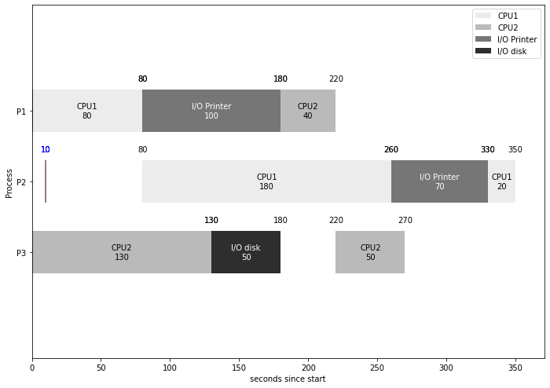

# Gantt Chart Generator based on Matplotlib

基于Matplotlib实现的甘特图生成器。可以用于绘制操作系统的进程调度图。

## Chart of Process Scheduling of Operating System

### Usage

You can import this respository into [Colab](https://colab.research.google.com/) or Jupyter Nootbook and work on `ProcessGantt.ipynb`. 